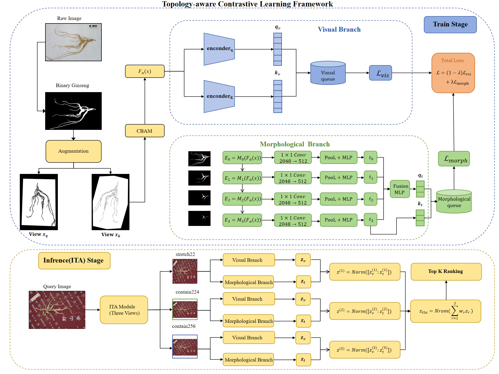
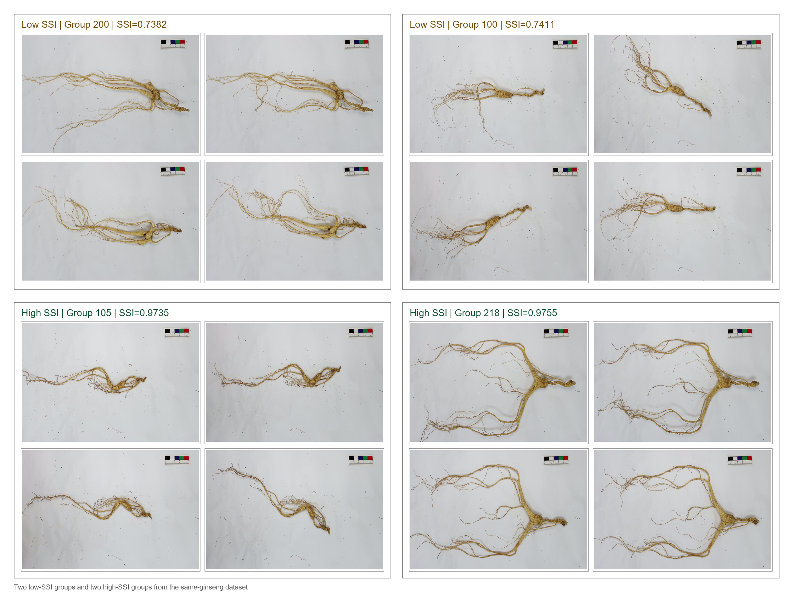
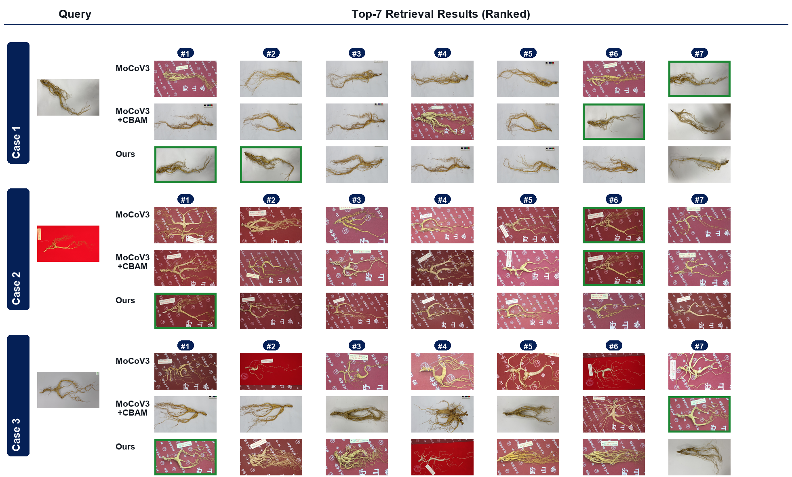

# Ginseng Re-identification

This repository contains the core implementation used for ginseng instance retrieval and re-identification experiments. The code focuses on non-rigid ginseng roots, where the same root can appear with different orientations, branch layouts, partial occlusion, and imaging conditions.

The main model is a contrastive-learning retrieval framework with a visual branch and morphology/topology-aware branches. The repository also keeps earlier hybrid-topology variants for ablation and comparison.

## Pipeline Overview



The full workflow starts from ginseng foreground extraction, then trains and evaluates a retrieval model that combines visual appearance with morphology-aware representations. During inference, `single_topo` supports test-time augmentation over three input forms and fuses their features before retrieval.

## Example Visualization



The example above shows two low-SSI groups and two high-SSI groups from the same-ginseng dataset. Low-SSI groups exhibit stronger within-instance structural variation, while high-SSI groups keep more consistent root layouts across views. The dataset and trained weights are not released in this repository; the image is included only as a small qualitative example for the repository page.

## Retrieval Results



The qualitative cases compare MoCoV3, MoCoV3+CBAM, and the proposed topology-aware method under the same query-gallery protocol. Green boxes mark correct same-ginseng retrievals. The proposed method moves more positive samples into earlier ranks, especially when background, orientation, or local root layout changes across views.

| Method | MRR | mAP | R@1 | R@5 | R@10 |
| --- | ---: | ---: | ---: | ---: | ---: |
| SimCLR | 0.8236 | 0.5775 | 0.2540 | 0.6193 | 0.7143 |
| MoCoV3 | 0.8774 | 0.6623 | 0.2772 | 0.6936 | 0.7797 |
| MoCoV3+CBAM | 0.8907 | 0.7060 | 0.2822 | 0.7332 | 0.8228 |
| Proposed method | 0.9454 | 0.8096 | 0.3060 | 0.8210 | 0.8747 |
| Proposed method + ITA | **0.9569** | **0.8500** | **0.3110** | **0.8552** | **0.9020** |

Compared with MoCoV3+CBAM, the proposed method improves mAP by 0.1036 and R@5 by 0.0878. With inference-time augmentation, the gains increase to 0.1440 mAP and 0.1220 R@5.

## Repository Layout

```text
.
|-- ginseng_extractor/
|-- single_topo/
|-- hybrid_v2/
|-- hybrid_v3/
|-- assets/
|-- requirements.txt
`-- README.md
```

`ginseng_extractor` contains the foreground extraction pipeline used before retrieval. `single_topo` is the recommended entry point for the final paper method. `hybrid_v2` and `hybrid_v3` keep earlier topology variants for ablation and comparison.

`single_topo` supports three inference-time input modes:

- `stretch224`: direct square resize to 224 x 224.
- `contain224`: aspect-preserving resize into a 224 x 224 canvas.
- `contain256`: aspect-preserving resize into a 256 x 256 canvas.

The three features are fused with configurable weights, then L2-normalized for retrieval.

## What Is Not Included

The repository intentionally excludes private or large local artifacts:

- raw ginseng images and dataset CSV files;
- `query_groups.json` files generated from local data;
- model checkpoints such as `.pth`, `.pt`, `.ckpt`;
- extracted feature caches;
- batch retrieval outputs and visualization results.

Use the provided `configs/default.example.json` files as templates and point them to your own dataset, query groups, and trained weights.

## Ginseng Foreground Extraction

The extraction code is in `ginseng_extractor/`. It uses GroundingDINO to locate the ginseng region and SAM or SAM-HQ to obtain masks and foreground cutouts. The released code keeps folder structure during batch processing and includes post-processing utilities for grayscale/binary conversion and cleaning extracted folders.

Expected external model files:

- `ginseng_extractor/model/groundingdino_swint_ogc.pth`
- `ginseng_extractor/model/sam_vit_h_4b8939.pth`
- `ginseng_extractor/model/sam_hq_vit_h.pth`

These files are intentionally ignored by Git because they are large external checkpoints. Download them from the official GroundingDINO and Segment Anything releases, then place them under `ginseng_extractor/model/`.

Run extraction:

```bash
python ginseng_extractor/ginseng_extractor.py \
  --input-root data/raw \
  --output-root outputs/extraction/cutout \
  --processed-root outputs/extraction/processed \
  --recursive \
  --batch-size 64
```

Generate grayscale and binary images from extracted foregrounds:

```bash
python ginseng_extractor/convert_image.py \
  --input-root outputs/extraction/processed \
  --output-gray outputs/extraction/gray \
  --output-binary outputs/extraction/binary \
  --binary-mode auto \
  --recursive
```

Clean intermediate extraction files against a grouped same-ginseng folder:

```bash
python ginseng_extractor/clean_extraction.py \
  --extraction-root outputs/extraction/processed \
  --same-root data/grouped \
  --dry-run
```

## Data Format

Training split CSV files should contain an `image` column. Each row points to one image path:

```csv
image
data/train/group_001/view_01.jpg
data/train/group_001/view_02.jpg
```

Batch retrieval uses a query-group JSON file:

```json
{
  "query_groups": [
    {
      "name": "group_001_view_01",
      "query_image": "data/gallery/group_001/view_01.jpg",
      "same_ginsengs": [
        "data/gallery/group_001/view_02.jpg",
        "data/gallery/group_001/view_03.jpg"
      ]
    }
  ]
}
```

You can generate this file from grouped folders with `build_query_groups.py`.

## Installation

Create a Python environment with PyTorch and install the remaining dependencies:

```bash
pip install -r requirements.txt
```

Install the PyTorch build that matches your CUDA or CPU environment from the official PyTorch instructions.

## Quick Start: single_topo

Copy the example config:

```bash
cp single_topo/configs/default.example.json single_topo/configs/default.json
```

Edit `single_topo/configs/default.json` so that `train_csv`, `val_csv`, `test_csv`, `image_dir`, `model_path`, `output_feats`, and `query_groups_json` point to your local data.

Train:

```bash
python single_topo/train.py
```

Extract gallery features:

```bash
python single_topo/extraction.py
```

Run batch retrieval:

```bash
python single_topo/batch_retrieval.py
```

Override any config value from the command line:

```bash
python single_topo/extraction.py --override image_dir=data/gallery --override output_feats=outputs/single_topo/gallery_feats_fused_tta.pt
```

## Query Group Generation

If your dataset is organized as one folder per ginseng root:

```text
data/grouped/
├── 001/
│   ├── view_01.jpg
│   └── view_02.jpg
└── 002/
    ├── view_01.jpg
    └── view_02.jpg
```

generate query groups with:

```bash
python single_topo/build_query_groups.py \
  --gallery-root data/gallery \
  --same-root data/grouped \
  --output-json data/query_groups.json \
  --query-strategy first \
  --min-images 2 \
  --suffixes .jpg,.png \
  --all-queries
```

## Hybrid Variants

`hybrid_v2` and `hybrid_v3` contain earlier multi-branch topology models. They are useful for reproducing ablations around:

- visual-only retrieval;
- legacy morphology branch;
- skeleton branch;
- edge branch;
- topology branch combinations;
- topology/visual fusion weights.

Their running pattern is the same as `single_topo`:

```bash
python hybrid_v3/train.py --config hybrid_v3/configs/default.json
python hybrid_v3/extraction.py --config hybrid_v3/configs/default.json
python hybrid_v3/batch_retrieval.py --config hybrid_v3/configs/default.json
```

## Analysis Utilities

Selected scripts are included for paper-related analysis:

- `single_topo/gradcam_visualization.py`: Grad-CAM style visualization for query/reference pairs.
- `single_topo/visualize_multilevel_erosion.py`: morphology-level visualization.
- `hybrid_v2/group_similarity.py`: group-level feature similarity analysis.
- `hybrid_v3/pair_similarity.py`: two-image similarity probing.
- `hybrid_v3/resolution_impact_analysis.py`: resolution sensitivity analysis.

For Grad-CAM case files that only contain filenames, set `GINSENG_IMAGE_SEARCH_DIRS` to one or more image roots before running the script.

## Notes

This code is released as the research implementation for the ginseng re-identification paper. The dataset and trained weights are not included in this repository. Results in the paper should be reproduced with the same data splits, query-group protocol, and trained checkpoints described in the manuscript.
